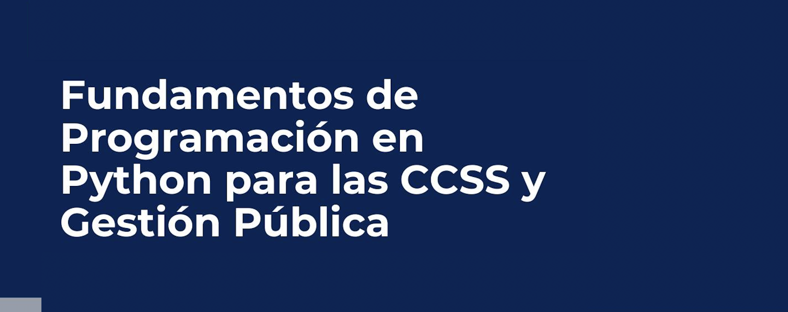

  

## 1.	Información General

| | | 
|:-|---|
| Nombre del curso		|  Fundamentos de Programación en Python para las CCSS y Gestión Pública  | 
| Profesor del curso		|  Victor Fuentes Campos  | 
| Correo electrónico PUCP	|  vfuentes@pucp.edu.pe| 

## 2. Sumilla

Este curso está diseñado para contribuir al desarrollo de habilidades de programación con Python e incoporarlo como una caja de herramientas para la investigación cuantitativa. El curso está dirigido a estudiantes con poca o sin experiencia en programación, pero que están interesados en aprender como la ciencia de datos convierte datos en conocimiento para la toma de decisiones. El curso cubrirá aspectos básicos de programación en Python, librerías NumPy y Pandas, el uso de Jupyter Notebook, limpieza y estandarización de DataFrames, visualización de datos y el uso de APIs.

## 3.	Presentación 

Este curso está dirigido a estudiantes de ciencias sociales con poca o sin experiencia previa con lenguajes de programación, o que recién han comenzado a utilizar programas estadísticos (como STATA, SPSS o R), y que les ha resultado atractiva la interacción con los datos mediante código. El curso busca preparar a los estudiantes para el mercado laboral, al brindar una habilidad altamente demandada, y que será una útil para un primer trabajo o práctica que involucre la ciencia de datos.

## 4. Resultados de aprendizaje

1. Aprender cómo usar GitHub y crear tu sitio web
1. Comprender conceptos básicos de programación usando diferentes objetos de Python
1. Escribir programas sencillos en Python para resolver problemas reales
1. Utilizar librerías y módulos (como NumPy y Pandas) para desarrollar Análisis Exploratorio de Datos (EDA)
1. Aplicar técnicas de limpieza y estandarización de DataFrames
1. Desarrollar piezas gráficas atractivas capaces de transmitir mensajes clave
1. Utilizar Python para interactuar con APIs web y extraer información de páginas web (web scraping).

## 5. Metodología

Las clases se desarrollarán de forma síncronica a través de Zoom (ver Paideia). En las aplicaciones de clase se usarán bases de datos vinculados a las ciencias sociales y la gestión pública.

## 6. Evaluación

La evaluación consiste en cuatro tareas y un trabajo final.

| # | Tipo de evaluación | Peso en la nota final |
|:-------------------|---| ---|
| 4 | Tareas | 60% |
| 1 | Trabajo final | 40%|

## 7. Bibliografía obligatoria

1.	"Python for Data Science Handbook" by Jake VanderPlas (O'Reilly, 2017) 
1.	"Python Crash Course" by Eric Matthes (No Starch Press, 2015) 
1.	"Python for Everyone" by Horstmann and Reed (Wiley, 2015)
1.	Stackoverflow

## 8. Cronograma tentativo

|Fecha|Temas|Subtemas|
|---|---|---|
19 de noviembre |  Github, Python & Jupyter   | • Instalación   • Branches   • Repositorios   • Colab   • Notebooks|
26 de noviembre |  Objetos de Python   | • Listas   • Tuplas   • Diccionarios   • Transformación de objetos |
28 de noviembre | EDA I: DataFrames | • NumPy   • Pandas  • Importación de datos   • Integración de bases de datos  |
3 de diciembre | EDA II: Transformación de datos | • Normalización y estandarización   • Creación de nuevas variables   • Funciones, condicionales y loops   |
5 de diciembre | EDA III: Datos anómalos y valores omitidos | • Lidiar con NAs   • Imputación de datos    |
10 de diciembre| Reducción de dimensiones|•  Análisis de componentes principales   •  Clústers |
12 de diciembre| Visualización de datos|•  Gráficos estáticos   •  Gráficos interactivos |
17 de diciembre| APIs y web scrapping|• Banco Mundial, BCRP, MEF   • Geolocation  |

## 9. Grupos (preliminar)

| Grupo| Integrante Nº 1 | Integrante Nº 2 |
|---|---|---|
|1|Jorge Aramburú |  Pía Quispe|
|2|Saby Sánchez |  Renzo Vidal|
|3|Margarita Mamani |  Luis Sánchez|
|4|Gabriel Vargas | Carlos Correa |
|5|Mario Román |  |

## 10. Recursos adicionales

1. Videos tutoriales
- https://www.youtube.com/watch?v=zyGfECfJ9BY
- https://www.youtube.com/watch?v=K5xImVmm2Ds

2. Plantillas
- https://bootstrapmade.com/bootstrap-portfolio-templates/
- https://cssauthor.com/free-bootstrap-portfolio-templates/
